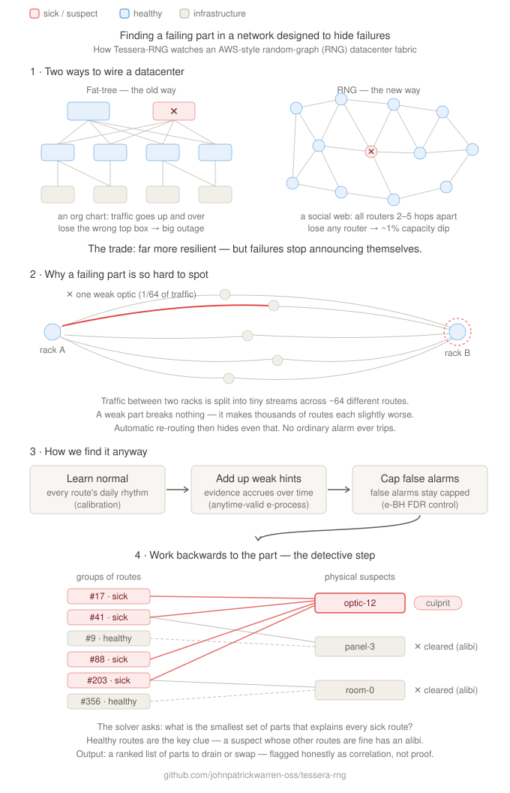

# Tessera-RNG

**Operational observability for flat random-graph (RNG-family) datacenter networks** —
anytime-valid per-path-class verdicts, e-BH FDR over correlated entities, and tomographic
localization of shared physical fault domains.

A fork of [Tessera](https://github.com/johnpatrickwarren-oss/tessera) (GPU-cluster shard
observability) that **reuses the same statistical engine**
([`deploysignal-engine`](https://github.com/johnpatrickwarren-oss/deploysignal-engine)) as a
git-dependency — never forked — repointed from cluster shards to network **path-classes** and
physical **fault domains**.

## The problem

A flat random-graph fabric (quasi-random graph topology, distributed edge-disjoint-path
routing, passive optical shuffle cabling) trades structural observability for resilience. Its
redundant paths smear failures across many flows and mask them with automatic re-routing — so
by the time a threshold alarm fires, the path-margin is already spent. Two hard problems
follow, and Tessera-RNG addresses both:

1. **Multiplicity at scale** — monitor 10³–10⁴ heavily-correlated path-classes without
   false-positive blowup (measured, not extrapolated: the coverage matrix's paper-scale proof
   runs the full stack at 1,456 leaves / 960 ToRs). *Solved by reuse:* hierarchical e-value combination + **e-BH FDR**,
   which controls the false-discovery rate **under arbitrary dependence** (load-bearing, since
   path-class signals are correlated through shared fiber/optic/shuffle hardware).
2. **Localization** — turn "something shifted" into "this shared physical resource is the
   culprit" on a topology where **hop distance does not encode fault domain**. *Solved by new
   math:* network tomography — a saturating leaky noisy-OR likelihood over a fault-domain
   incidence hypergraph, built into a minimal explaining set by marginal-LLR greedy
   construction. RNG's many edge-disjoint paths make the measurement matrix well-conditioned,
   so the same path diversity that masks failures makes the inversion identifiable.



## How it works

```
synthetic raw telemetry            per-cell calibration            per-path-class detection
(5-signal vectors, per-cell  ──▶   (HoD × DoW × traffic-class) ──▶  Family A (mean-shift) +
 baseline "smear" + injected        baselines, AR(p) pre-whitening,  Family C (learned-Σ
 resource degradations —            raw → standardized residual      distributional) +
 simultaneous faults compose;                                        Family D (spectral)
 reconvergence epochs reroute                                               │
 traffic mid-stream)                                                        ▼
   simulated route-drain   ◀──  tomographic localization   ◀──  hierarchical combine + e-BH
   (tiered drain targets,       (saturating noisy-OR mixture     FDR surface (which path-
    one drain per resource)      LLR over weighted incidence;     classes are degraded; on
                                 marginal-LLR set construction;   incidence change, e-process
                                 per evidence epoch;              wealth resets are RECORDED
                                 correlational-not-causal)        in the audit, never silent)
```

Everything is deterministic and replay-clean: the same incidence model + telemetry stream
produce a byte-identical `AuditRecord` — including across reroute epochs and multi-fault runs.

## Quickstart

```bash
pnpm install          # resolves the engine git-dep (deploysignal-engine#v0.3.1-pre)
pnpm test             # tsc -p tsconfig.test.json && node --test test/*.test.js
pnpm typecheck
pnpm demo             # -> demos/demo.html  (eight deterministic scenarios, single file)
pnpm coverage         # -> coverage-matrices/coverage-saturation.{json,md}
pnpm gate             # sprag architectural gate over the repo
```

Requires Node ≥ 20 and pnpm ≥ 11.

## What's built

Synthetic fixtures only (no live fabric — deliberately, see the anti-scope). The v1 walking
skeleton plus seven post-v1 rounds, one ADR per real decision:

- **Detection** — three anytime-valid families per path-class with per-detector α-budget:
  Family A (multi-signal mean-shift betting e-process), Family C (Safe-Hotelling over a
  **learned** cross-signal covariance), Family D (spectral — catches periodicity A and C are
  blind to). Per-cell calibration (HoD × DoW × traffic-class) with AR(p) pre-whitening and a
  min-sample pooled fallback.
- **Selection** — hierarchical e-value combine + e-BH FDR, valid under the arbitrary
  dependence the shared hardware creates (clean fabrics select nothing, measured).
- **Localization** — the tomographic solver over **weighted (fractional) incidence**: an
  exposure-saturating leaky noisy-OR mixture LLR (an extreme fault fires even a 1/64-diluted
  leaf, and the model can say so), built into a minimal culprit set by **marginal-LLR greedy
  construction** (each pick's posterior folds into per-leaf residuals; later candidates score
  only what remains surprising). Localizes simultaneous cross-kind faults; on epoch'd runs,
  drain targets are tiered so every evidence group's strongest culprit drains first. An
  on-demand **ToR-pair drill-down** completes the story — fleet → fault domain → impacted
  underlying pairs, FDR-controlled over the examined set, with truncation always reported.
  100 % mutation score on the new math (recorded per round in the ADR trail).
- **Production-shaped fabrics** — the Spraypoint two-view fabric (per-ToR ∪ per-panel-pair
  aggregation views over the underlying ToR-pair traffic — the production fabric's ~460 K
  pairs deliberately exceed any per-pair leaf budget, which is exactly why the leaf is a view;
  the default model is 64 ToRs ⇒ ~2 K pairs at 1/64 dilution), reconciled against the RNG
  fabric paper (arXiv:2604.15261); **reconvergence epochs**
  (synthetic reroute events; e-process wealth resets recorded in the audit as deliberate,
  visible power loss); **simultaneous multi-fault injection** with exact composition.
- **Honest measurement** — detection *and* attribution floors for every anomaly mode, both
  fabric regimes (binary and fractional-dilution), AND simultaneous multi-fault pairs
  (both-in-top-2), per-view blind-spot maps, clean-fabric FDR controls for each fabric,
  firing-mode attribution in every audit — caveats in the open. The published artifacts are
  freshness-bound by tests: the demo byte-exactly, the coverage matrix by spot-checked cells
  (an honest partial bind, named as such in the tests).

The statistical layer localizes to a shared-resource **fault domain**, never to a specific
marginal optic — hardware root-cause is out of scope, and every culprit carries a
`correlational_not_causal` flag with the unexplained set always reported.

## Built with archgate

This repo was built under the **archgate** discipline: the Anchor disciplines as an
in-context contract ([`DISCIPLINES.md`](DISCIPLINES.md)) plus the **sprag** gate as a
deterministic architectural floor ([`arch-gate-usage.md`](arch-gate-usage.md)). Spec-first and
impl-blind, anti-scope-first, every conjunct bound to a test, mutation testing on the new
math, and a fresh-context cold-eye review closing every round — several of which falsified
the build's own headline claims before they shipped (the trail records each one).

- [`STATE.md`](STATE.md) — the cold-readable "now".
- [`design/spec/v1-spec.md`](design/spec/v1-spec.md) — the v1 contract (anti-scope first; ACs).
- [`design/adr/`](design/adr/) — one ADR per real decision (start at ADR-0001).

## License

Apache-2.0.
